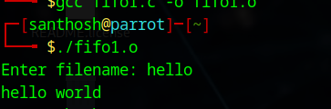

# Linux-IPC--Pipes
Linux-IPC-Pipes

# Ex03-Linux IPC - Pipes

# AIM:
To write a C program that illustrate communication between two process using unnamed and named pipes

# DESIGN STEPS:

### Step 1:

Navigate to any Linux environment installed on the system or installed inside a virtual environment like virtual box/vmware or online linux JSLinux (https://bellard.org/jslinux/vm.html?url=alpine-x86.cfg&mem=192) or docker.

### Step 2:

Write the C Program using Linux Process API - pipe(), fifo()

### Step 3:

Testing the C Program for the desired output. 

# PROGRAM:

## C Program that illustrate communication between two process using unnamed pipes using Linux API system calls
~~~
#include <stdio.h>
#include <stdlib.h>
#include <sys/types.h>
#include <sys/stat.h>
#include <string.h>
#include <fcntl.h>
#include <unistd.h>
#include <sys/wait.h>

void server(int, int);
void client(int, int);

int main() {
    int p1[2], p2[2], pid;

    pipe(p1);
    pipe(p2);

    pid = fork();

    if (pid == 0) {
        // Child process → server
        close(p1[1]); // close write end of pipe1
        close(p2[0]); // close read end of pipe2
        server(p1[0], p2[1]);
        exit(0);
    }

    // Parent process → client
    close(p1[0]); // close read end of pipe1
    close(p2[1]); // close write end of pipe2
    client(p1[1], p2[0]);

    wait(NULL);
    return 0;
}

void server(int rfd, int wfd) {
    int n;
    char fname[2000], buff[2000];

    // Read filename from client
    n = read(rfd, fname, sizeof(fname));
    fname[n] = '\0';

    int fd = open(fname, O_RDONLY);

    if (fd < 0) {
        write(wfd, "can't open", 10);
    } else {
        n = read(fd, buff, sizeof(buff));
        write(wfd, buff, n);
        close(fd);
    }
}

void client(int wfd, int rfd) {
    int n;
    char fname[2000], buff[2000];

    printf("Enter filename: ");
    scanf("%s", fname);

    // Send filename to server
    write(wfd, fname, strlen(fname) + 1);

    // Read response from server
    n = read(rfd, buff, sizeof(buff));
    buff[n] = '\0';

    // Print output
    write(1, buff, n);
}
~~~

## OUTPUT

## C Program that illustrate communication between two process using named pipes using Linux API system calls

~~~
#include <stdio.h>
#include <stdlib.h>
#include <unistd.h>
#include <fcntl.h>
#include <sys/types.h>
#include <sys/stat.h>
#include <string.h>

#define FIFO_FILE "/tmp/my_fifo"
#define FILE_NAME "hello.txt"

void server();
void client();

int main() {
    pid_t pid;

    // Create FIFO (named pipe)
    mkfifo(FIFO_FILE, 0666);

    pid = fork();

    if (pid > 0) {
        // Parent process → server
        sleep(1);  // ensure client opens FIFO first
        server();
    } 
    else if (pid == 0) {
        // Child process → client
        client();
    } 
    else {
        perror("Fork failed");
        exit(EXIT_FAILURE);
    }

    return 0;
}

void server() {
    int fifo_fd, file_fd;
    char buffer[1024];
    ssize_t bytes_read;

    // Open file to read
    file_fd = open(FILE_NAME, O_RDONLY);
    if (file_fd == -1) {
        perror("Error opening file");
        exit(EXIT_FAILURE);
    }

    // Open FIFO for writing
    fifo_fd = open(FIFO_FILE, O_WRONLY);
    if (fifo_fd == -1) {
        perror("Error opening FIFO");
        exit(EXIT_FAILURE);
    }

    // Read from file and write to FIFO
    while ((bytes_read = read(file_fd, buffer, sizeof(buffer))) > 0) {
        write(fifo_fd, buffer, bytes_read);
    }

    close(file_fd);
    close(fifo_fd);
}

void client() {
    int fifo_fd;
    char buffer[1024];
    ssize_t bytes_read;

    // Open FIFO for reading
    fifo_fd = open(FIFO_FILE, O_RDONLY);
    if (fifo_fd == -1) {
        perror("Error opening FIFO");
        exit(EXIT_FAILURE);
    }

    // Read from FIFO and print to stdout
    while ((bytes_read = read(fifo_fd, buffer, sizeof(buffer))) > 0) {
        write(STDOUT_FILENO, buffer, bytes_read);
    }

    close(fifo_fd);
}
~~~

## OUTPUT

# RESULT:
The program is executed successfully.
